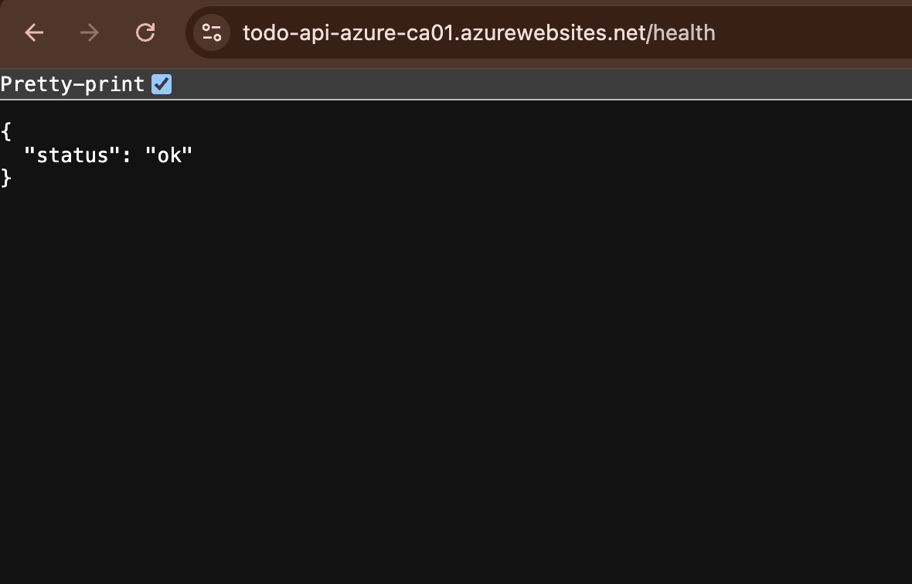

# todo-api-azure


A tiny, production‑ish demo that proves hands‑on experience with:

- **Node 20 + Express**
- **SQL Server** (official `mssql` driver)
- **Docker** (multi‑stage image)
- **GitHub Actions CI/CD**
- **Azure Container Registry (ACR)**
- **Azure App Service for Containers**
- **Application Insights**

This repo intentionally keeps the scope *small* while touching the real tools you’ll use on the job.

---

## What this project shows

- REST API with:
  - `GET /health` → `{ "status": "ok" }`
  - CRUD for `tasks`
- **Validation**: rejects missing/empty `title`
- **HTTP correctness**: `201` on create, `404` when not found, `204` on delete, etc.
- **Logging**: one line per request (method, path, status, latency)
- **DB bootstrap**: on first boot (local), ensures the `tasks` table exists (idempotent)
- **Observability**: Application Insights SDK is initialized **before** routes

> ⚠️ **Zero‑cost cloud path**: The Azure deployment runs the container + telemetry only.  
> The database stays local (via Docker Compose). In Azure, only `/health` is expected to work by default.  
> You can wire Azure SQL for full cloud CRUD later.

---

## Quick start (local)

**Requirements:** Docker Desktop.

```bash
# from repo root
docker compose up --build
```

**Once up**, test the API:

```bash
# health
curl -s http://localhost:3000/health
# -> {"status":"ok"}

# create
curl -s -X POST http://localhost:3000/tasks \
  -H 'content-type: application/json' \
  -d '{"title": "Buy milk"}'

# list
curl -s http://localhost:3000/tasks

# get by id
curl -s http://localhost:3000/tasks/1

# toggle done
curl -s -X PATCH http://localhost:3000/tasks/1

# delete
curl -i -X DELETE http://localhost:3000/tasks/1
```

**Compose logs** (typical):
```
todo-api-azure listening on :3000
Connected to SQL Server
Ensured dbo.tasks table exists
```

---

## API

### Table

```sql
CREATE TABLE dbo.tasks(
  id INT IDENTITY PRIMARY KEY,
  title NVARCHAR(200) NOT NULL,
  done BIT NOT NULL DEFAULT 0,
  created_at DATETIME2 NOT NULL DEFAULT SYSUTCDATETIME()
);
```

### Endpoints (summary)

- `GET /health` → `{ "status": "ok" }`
- `GET /tasks` → array of tasks
- `GET /tasks/:id` → task or `404`
- `POST /tasks` (`{ "title": "..." }`) → `201` + task
- `PATCH /tasks/:id` → flips `done` and returns task (or `404`)
- `DELETE /tasks/:id` → `204` (or `404`)

Error responses: `500` as `{ "error": "message" }`.

---

## Project structure

```
.
├─ src/
│  ├─ server.js           # boots AI, Express, routes, error handler
│  ├─ db.js               # SQL pool + safe query helper + schema ensure
│  ├─ logging.js          # per-request log line (method, path, status, ms)
│  └─ routes/
│     ├─ health.js
│     └─ tasks.js
├─ test/health.test.js    # minimal node:test + supertest
├─ Dockerfile             # multi-stage; small final image
├─ docker-compose.yml     # api + sqlserver (local dev)
├─ .github/workflows/deploy.yml
├─ .eslintrc.json         # basic rules
├─ .eslintignore
├─ .env.example           # safe, shareable env template
├─ .dockerignore
└─ README.md
```

---

## Configuration

### Local env (.env)

`.env.example` shows sane defaults for Compose:

```
PORT=3000
DB_HOST=sqlserver
DB_PORT=1433
DB_USER=sa
DB_PASS=YourStrong!Passw0rd
DB_NAME=master
```

### Azure App Settings (App Service → Configuration)

- `WEBSITES_PORT=3000`  ← required for custom containers
- `SKIP_DB_INIT=1`      ← **set this for zero‑cost path** (avoid DB connect attempts)
- `APPLICATIONINSIGHTS_CONNECTION_STRING=...`  ← from your AI resource

> The app reads `APPLICATIONINSIGHTS_CONNECTION_STRING` and initializes AI **before** routes, so request/exception telemetry flows automatically.

---

## CI/CD (GitHub Actions → ACR → App Service)

**Trigger:** push to `main`.

**Jobs:**

1) `setup-node`, install deps, run lint + tests  
2) **Build** Docker image  
3) **Login** to ACR and **push** image  
4) **Azure login** (service principal)  
5) Update Web App for Containers to use that image tag  
6) Set `WEBSITES_PORT=3000` app setting

### Required repo secrets

Create in **Settings → Secrets and variables → Actions**:

- `AZURE_CREDENTIALS` – JSON from `az ad sp create-for-rbac --sdk-auth` (scoped to your RG)
- `ACR_LOGIN_SERVER` – e.g., `myregistryca01.azurecr.io`
- `ACR_USERNAME`
- `ACR_PASSWORD`
- `AZURE_WEBAPP_NAME` – e.g., `todo-api-azure-ca01`
- `AZURE_RESOURCE_GROUP` – e.g., `rg-todo-api-azure`

### (Example) Create the service principal JSON

> **Example only** – names/IDs change in your subscription.

```bash
SUB_ID=$(az account show --query id -o tsv)
az ad sp create-for-rbac \
  --name "gh-todo-api-azure-<uniq>" \
  --role contributor \
  --scopes "/subscriptions/$SUB_ID/resourceGroups/<YOUR_RG>" \
  --sdk-auth
# paste the JSON output into the AZURE_CREDENTIALS secret verbatim
```

---

## Azure setup (zero‑cost path)

**One‑time** – create ACR + App Service + App Insights (names are examples):

```bash
# resource group
az group create -n rg-todo-api-azure -l eastus2

# ACR
az acr create -n myregistryca01 -g rg-todo-api-azure --sku Basic
az acr update -n myregistryca01 --admin-enabled true

# App Service Plan (Linux)
az appservice plan create -n plan-todo-api-azure -g rg-todo-api-azure --is-linux --sku B1

# Web App for Containers
az webapp create -n todo-api-azure-ca01 -g rg-todo-api-azure -p plan-todo-api-azure

# Application Insights (workspace-based)
# create a workspace + AI resource in the same region; copy the AI Connection String
```

Once repo secrets are set, **push to `main`** – the workflow builds/pushes the image and points the web app at it. Visit:

```
https://todo-api-azure-ca01.azurewebsites.net/health
```

---

## Tests & lint

- **Tests**: Node’s built‑in runner + supertest (`npm test` runs `node --test`)
- **Lint**: ESLint basic recommended rules (`npm run lint`)

---

## Screenshots (placeholders in README)

Add screenshots to document your cloud work:
- **Health endpoint live on Azure**  
  

---

## Assumptions & limits

- The **cloud deployment is zero‑cost**: DB stays local. Only `/health` is expected to work on Azure by default.

---

## Troubleshooting

- **`/health` shows 502 right after deploy**  
  App Service may still be pulling the container. Wait ~60s and refresh. Verify `WEBSITES_PORT=3000`.

- **GitHub Action fails on Azure login**  
  Ensure `AZURE_CREDENTIALS` is a *valid JSON object* pasted verbatim (no extra quotes/backticks).

- **ACR push fails**  
  Recheck `ACR_LOGIN_SERVER`, `ACR_USERNAME`, `ACR_PASSWORD`. Ensure ACR admin is enabled for demo simplicity.

- **See live logs**  
  `az webapp log tail -g <RG> -n <APP>`

---

## Cleanup (stop all Azure costs)

```bash
az group delete -n rg-todo-api-azure --yes --no-wait
```

